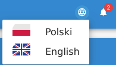
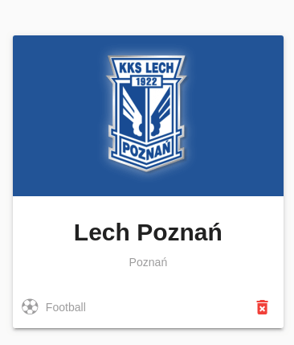
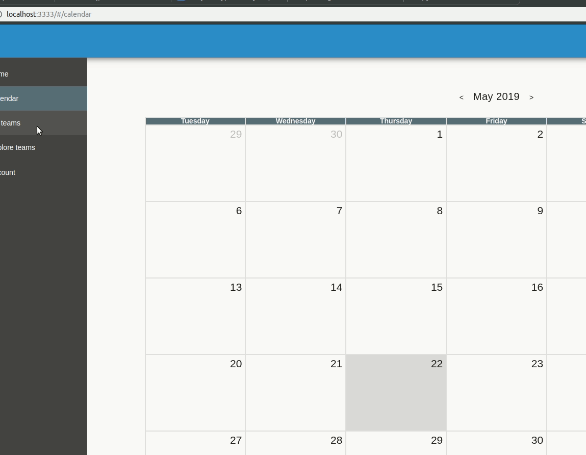
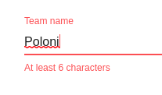
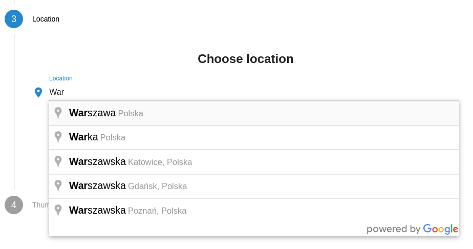
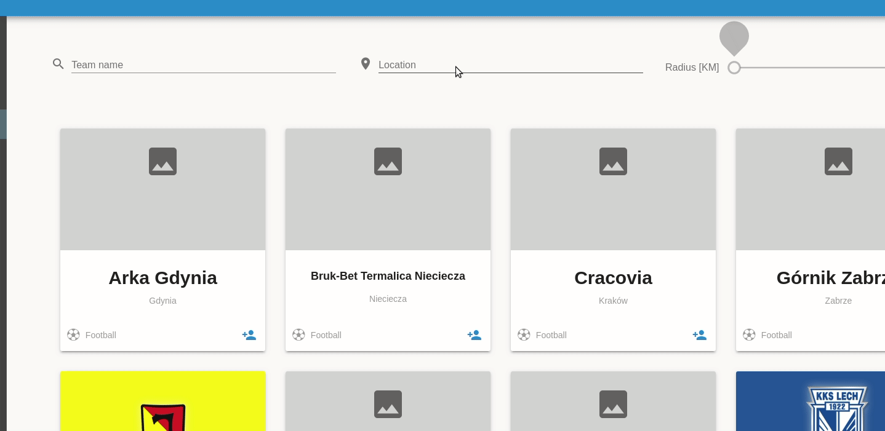
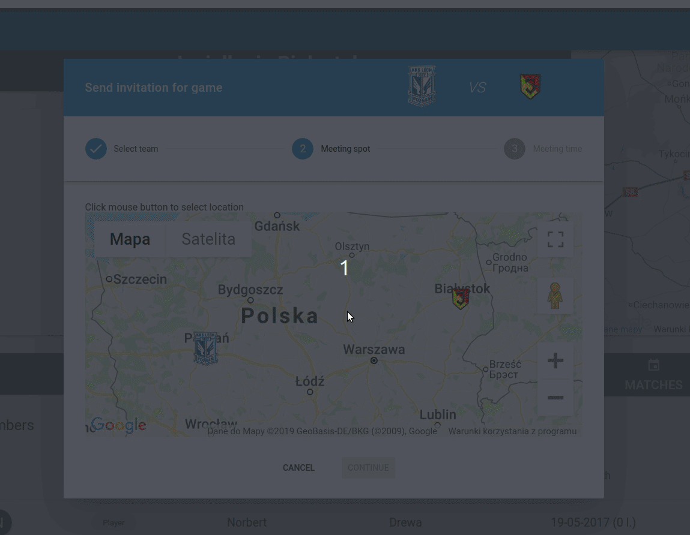
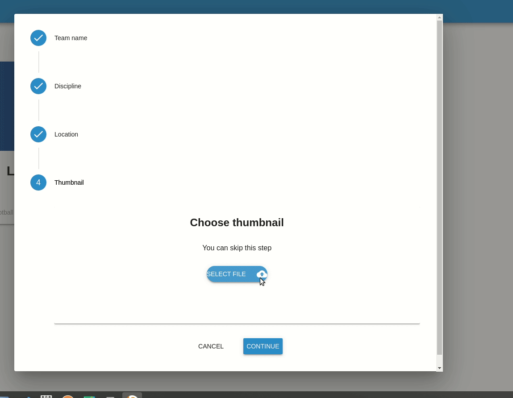
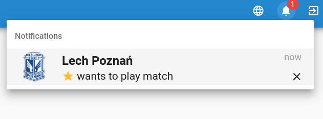
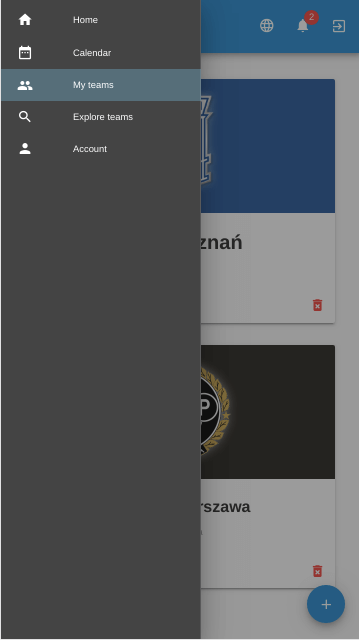

## Quick start
> Project skeleton: [vue-web-starter](https://github.com/michalzaq12/vue-web-starter)

  ```bash
  # install dependencies
  npm install
  
  # build all vendor modules (only once)
  npm run dll
  
  # serve with hot reload at localhost:3333
  npm run dev
  ```


## About project

Project concerns implementation of internet portal helping to unite amateur sport teams and organise matches between teams from local communities. The portal consists of back-end application, mobile application and web application. Communication between these components is based on REST architecture. 

This repo contains only web application

## Application screenshots

[LINK](https://github.com/michalzaq12/team-management-app/tree/master/screenshots)

## Features

* Internationalization



* Adaptive UI 

Use the median cut algorithm provided by quantize.js to cluster similar
colors and return the base color from team thumbnail, then fill card background



*  Transitions between pages & custom loader



* Forms validation



* Google Autocomplete / Places API





* Google Maps API



* Thumbnail preview & upload



* Notifications 



* Responsive Web Design


